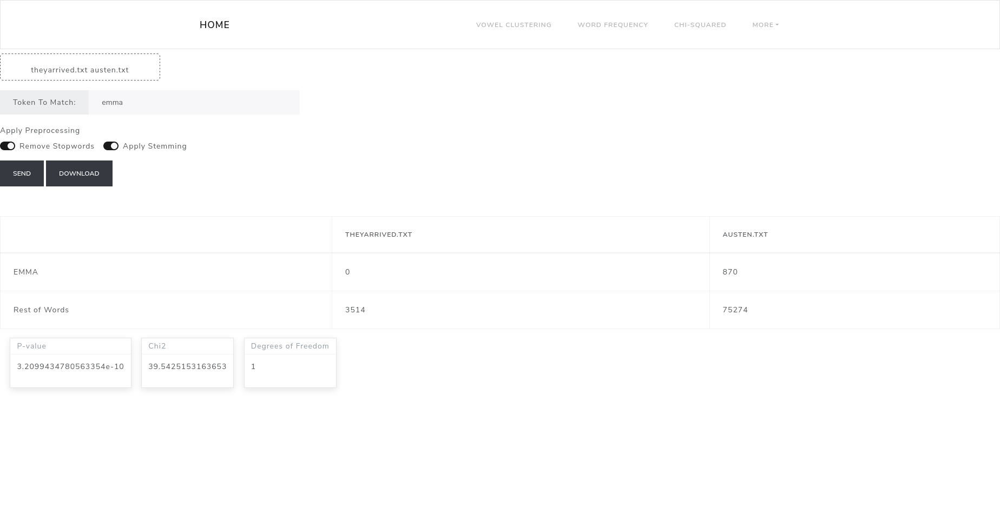

# NLP Workspace Documentation

---
  
  
This webapp allows you to perform basic computational & corpus linguistics tasks.  
This is still under development.  
  
  
## Clustering Vowels

You can provide a tabulated file (csv, excel or txt), which has F1-F4 columns containing vowel formant values.
You can then choose which kind of unsupervised model to use, based on the model chosen, you can modify some of the parameters.
Once you fit the model, you will have a chart of the clusters generated by the model.

## Chi-squared test

You can provide multiple files and choose a word to perform a chi-squared test. The frequency of the word will be found in each file and then the frequency table, along with the p-value and chi2 value will be returned.

You can decide to include or not stopwords and to apply or not stemming.

## Word Frequency

You can provide one text file from which the most common tokens will be extracted. You can choose whether to include stopwords, apply stemming, add extra stopwords, get ngrams instead of single tokens, change the number of result rows returned and download the results.

## Word Vectors

You can provide a text file and from it word vectors will be produced, the vectors will be reduced to 2 dimensions using PCA and you will be able to download the 2d points of the vectors.

